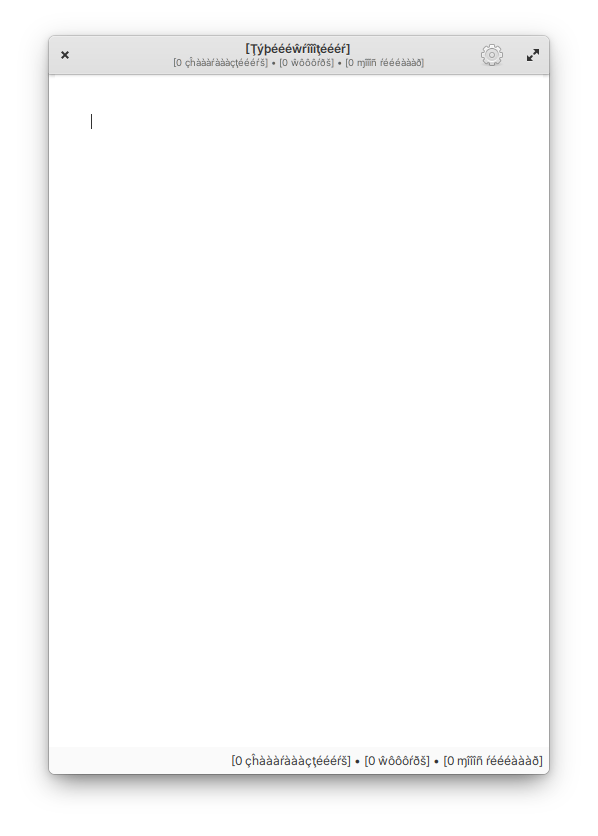

  <h1 align="center">
Pseudo Language
</h1>
  <h3 align="center">
Create pseudo translations for you applications
</h3>
   
   

---

Small command line tool to create fake translations that remain readable to an English speaking developer, and allows them to test for translation related expansion of the UI.
Based on [Pseudo Localization @ Netflix](https://netflixtechblog.com/pseudo-localization-netflix-12fff76fbcbe) and [node-pseudo-l10n](https://github.com/maxnachlinger/node-pseudo-l10n).

  

## Building, Testing, and Installation
You'll need the following dependencies:

    meson
    gee-0.8
    gio-2.0
    valac

Run meson build to configure the build environment. Change to the build directory and run ninja test to build and run automated tests

    meson build --prefix=/usr
    cd build
    ninja test

To install, use ninja install, then execute with `com.github.meisenzahl.pseudo-language`

    sudo ninja install
    com.github.meisenzahl.pseudo-language

## Usage
You can use `com.github.meisenzahl.pseudo-language` to scan your projects easily. By default, it will look for a `po` directory in your project and configure it

    com.github.meisenzahl.pseudo-language

To list all options, type `com.github.meisenzahl.pseudo-language -h`.

After `com.github.meisenzahl.pseudo-language` created the `po/pseudo.po` and you rebuilt your application and installed it, you can test the UI of your application with `LANGUAGE=pseudo` from the commandline.
